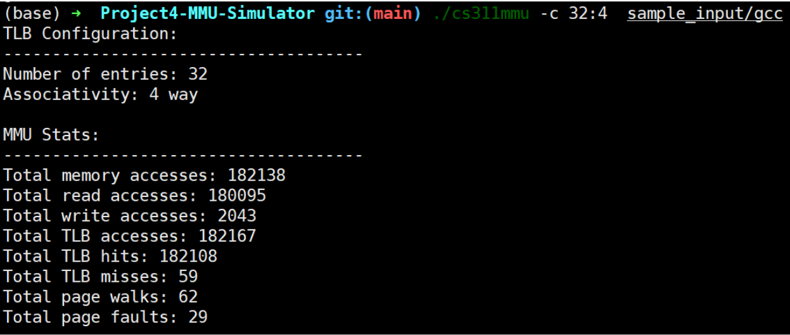
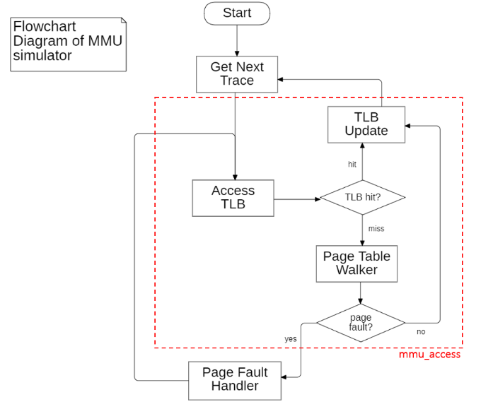
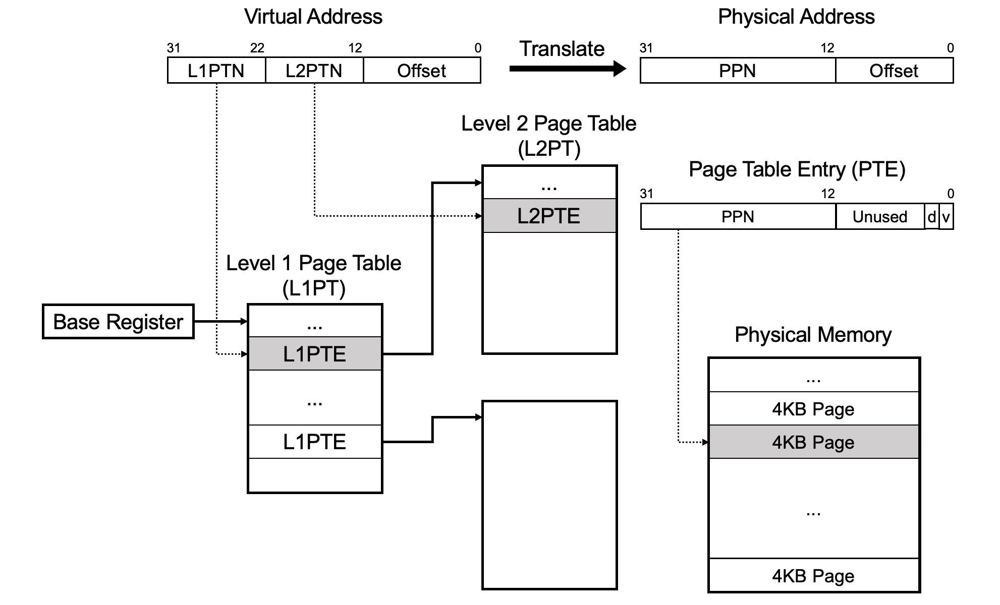

# Project 4.  MMU Simulator

Due 23:59, June 8th, 2023 (KST)
TA: cs311_ta@casys.kaist.ac.kr

## 1. Introduction

This fourth project is to build a trace-based MMU (Memory Management Unit) simulator. In this project, you will implement three main components of address translation: *TLB*, *page table walker*, and *page fault handler*.  The TLB and page table walker are two HW components in the MMU of the processors. The page fault handler is part of the OS, but in this project, your simulator will mimic a small part of the page fault handling procedure, which updates the page table. This project uses 32-bit addresses, and a page table is organized as a two-level tree. The TLB in the MMU should be configurable to adjust capacity (the number of entries), and associativity with command-line options.

**Please read this document carefully before you start!**

**If you have any questions related to the project, please ask them on the Piazza board or email(cs311_ta@casys.kaist.ac.kr) or visit during the project office hour.

## 2. GitLab Repository

You need to repeat the same procedure of forking and cloning the repository explained in the document for the previous projects. The only difference is that you should start from the TA’s repository of Project 4 (http://cs311.kaist.ac.kr/cs311/project4-mmu-simulator). Please check prior notifications available in Piazza board, for more information about getting started with GitLab.

## 3. Simulator Input and Output Specification

The simulator gets a **trace file** as an input. The input trace file contains a sequence of read or write operations with addresses. For each step, an entry of the trace is fed to the MMU simulator, to simulate the internal operation of the MMU. The replacement policy of the TLB must be the perfect LRU, and the page size is fixed to 4KB.

### 3.1 TLB Parameters

The MMU simulator has two configurable parameters: the number of TLB entries and associativity. The range of each parameter is specified below:

- Number of TLB entries: 16 entries ~ 128 entries (always powers of 2) 
- Associativity: 1, 2, 4, 8 ways, or fully associative TLBs. (<u>When the number of entries is equal to associativity, the TLB should be configured as a fully-associative one.</u>)

- Command
  ```
  $ ./cs311mmu -c number_of_entries:associativity  [-x] <input trace file>
  ```
ex) Simulating "gcc" trace on "cs311mmu" with 32 entries and 4 way options
```
  $ ./cs311mmu -c 32:4 sample_input/gcc
```


  Options
  - -c: TLB configuration specification.
  - -x (optional): Dump the TLB content and the page table content at the end of simulation 

### 3.2 Input Trace File

An input trace file contains a sequence of read or write operations with addresses like below.
```
R 0x10000000
W 0x10003231
R 0x12341245
R 0x10003231
W 0x10023414
...
```
R denotes read, while W means write. Note that the notation of addresses are always hexadecimal, with prefix 0x.R denotes read, while W means write.

### 3.3 Output
The summary of memory-related stats should be printed out at the end of the simulation:

- the number of total memory accesses
- the number of memory read accesses
- the number of memory write accesses
- the number of TLB hits
- the number of TLB misses 
- the number of page table walks
- the number of page faults

Please check the sample outputs for given examples for more information.


## 4. Simulator Behavior


### 4.1 Simulation behaviors of main components and implementation details 
For each memory access (one entry in the input trace), the following steps are simulated:

**PTE = page table entry**

Component 1: TLB access simulation:  
- In case of a TLB hit
  - Update the TLB entry accordingly.
  - As for write access, if the TLB entry is not marked as dirty yet, mark both the TLB entry and the corresponding page table entry as dirty (You may need to walk the page table).
- In case of a TLB miss
  - (Simulated) page table walker should traverse the page table to fetch the missing PTE. 
  - If either level 1 or level 2 PTE is not valid, stop its procedure and handle the page fault first (*TLB access should be tried again immediately after page fault is handled)
  - Upon a successful PTE retrieval, update TLB accordingly.
  - As for write access, if the TLB entry is not marked as dirty, set it as dirty.

Component 2: Page table walker simulation
- Starting from a base address of the page table, search for the corresponding PTE. (Hint: page_table_base_addr())
  - In case of a success, retrieve the corresponding PTE. In addition, if it is a write access, mark the PTE dirty if it is not previously marked as dirty.
  - In case of a failure, stop its procedure for page fault handling (page table walk needs to be tried again later)

Component 3: Page fault handler
- Retrieve the corresponding level 1 PTE
  - If the retrieved level 1 PTE is not valid, allocate a new page table node and set the corresponding level 1 PTE properly. (Hint: get_new_page_table_node())
- Retrieve the corresponding level 2 PTE
  - If the retrieved level 2 PTE is not valid, allocate a new physical page and set the corresponding level 2 PTE properly. (Hint: get_new_physical_page())
- For page fault handling with write access, mark the level 2 PTE as dirty.



<div align="center">
<strong>Overview of MMU simulator in flowchart diagram</strong>
</div>



<div align="center">
<strong>Two-level page table walk overview</strong>
</div>

### 4.2 Internal APIs

The following APIs are defined in util.c and **must not be updated**.

* `void init()` :  Initialize the internal emulated memory and 1st-level page table node. The 1st-level page table node (4KB) is created during the initialization, so you must not create one for yourself.

* `addr_t page_table_base_addr()` : returns the base address of the base page table.

* `addr_t get_new_physical_page()`: returns the address of a new 4KB page. This function must be called to get a new physical 4KB memory to handle a page fault. To get the address of a page table node, you must use the following function `get_new_page_table_node()`.

* `addr_t get_new_page_table_node()` : returns the address of a new page table node. This function must be called to get a new page table node for the 2nd-level page table node. The data in the allocated page table node is cleared to 0. You don’t need to initialize the allocated page table node manually.

* `uint32_t mem_read_word32()` and `void mem_write_word32()` : read or write a 32-bit word from/to the memory. <u>Note that these functions are used to access the contents of the page table only.</u>

* `void dump_page_table_area()`: It writes the contents of the page table to a file whose name is fixed to “page_table_dump”. This function must be used to dump the page table content for “-x” option.

* `void cdump()`: Print out the configuration of MMU

* `void sdump()`: Print out the run statistics.

[**IMPORTANT**] The emulated memory is used <u>only for page table nodes.</u> It contains the first-level and second-level page table nodes. `dump_page_table_area()` prints the content to the file.
 
[**IMPORTANT**] However, the actual physical page mapped to a virtual page of the process is not created as the MMU simulation does not need to access those pages. Therefore, `get_new_physical_page()` only returns a physical address, and the returned address will be used to fill the second-level PTE to handle a page fault.

### 4.3 PTE Format
* Width: 32 bits
* Bit 31~12: 20-bit physical page number for a 2nd-level page table node or physical page.
* Bit 11~2: Ignored.
* Bit 1: Dirty bit (Page table entry in level 2 page table only. L1PTE (Level 1 Page Table Entry) in the level 1 page table does not set this bit.).
* Bit 0: Valid bit (Have to set in both level 1 and 2 page table entries.).

## 5. Grading Policy

Your submissions will be graded for a total of 80 possible combinations (4 candidates of memory trace inputs * 4 candidates of TLB entry counts * 6 candidates of associativity values), and among them, 8 cases (2 types of traces and 4 combinations of TLB configuration) are provided as samples. Please refer to the Makefile for the details of the sample test cases. 

To get credits, your simulator should print the exact same output as the reference solution. You can evaluate your code with given examples by comparing your output with files in `sample_output` directory. You may check the correctness of your code by executing make test at your working directory of this project. If there are any differences (including whitespaces) it will print the differences. If there is no difference for an example, it will print “Test seems correct”.

Please make sure your outputs for given examples are identical to the files in the sample_output directory, without any redundant prints. Every single character of the output must be identical to the given sample output. Otherwise, you will receive a 0 score for the example. **Note that simply hard-coding outputs for given examples would lead you to 0 score for this project.**

## 6. Submission (Important!!)

Make sure your code works well on our <u>class Linux server.</u> It is highly recommended to work on the class server, since your project will be graded on the same environment as those servers.
Add the `submit` tag to your final commit and push your work to the gitlab server. If there is no `submit` tag, your work will not be graded. Please do not forget to submit your work with the tag.
Please make sure you push your work before the deadline. If you do not “push” your work, we won’t be able to see your work so that your work will be marked as unsubmitted.
For more information about the submission procedure, please refer to the specification of project 1, chapter 5 ‘Submission’ as well as notes on piazza.


## 7. Late Policy & Plagiarism Penalty (Important!!)

You will lose **30% of your score** on the first day **(June 9th 0:00~23:59)**. We will not accept any works that are submitted after then.
**Be aware of plagiarism!** Although it is encouraged to discuss with others and refer to extra materials, copying other students’ or opened code is strictly banned: Not only for main routine functions, but also helper functions. TAs will compare your source code with open-source codes and other students’ code. If you are caught, you will receive a serious penalty for plagiarism as announced in the first lecture of this course. If you have any requests or questions regarding administrative issues (such as late submission due to an unfortunate accident, GitLab is not working) please send an email to TAs.


## 8. Tips

- Modifying your repository via http may cause some problems.
- In this project, you can freely define functions, macros, structs and classes (C++) you need.
- You may use C++ instead of C if you want. Just make sure your ‘make test’ command works properly.
- Please start as early as possible.
- Please read this document and the given skeleton code carefully before you start.

